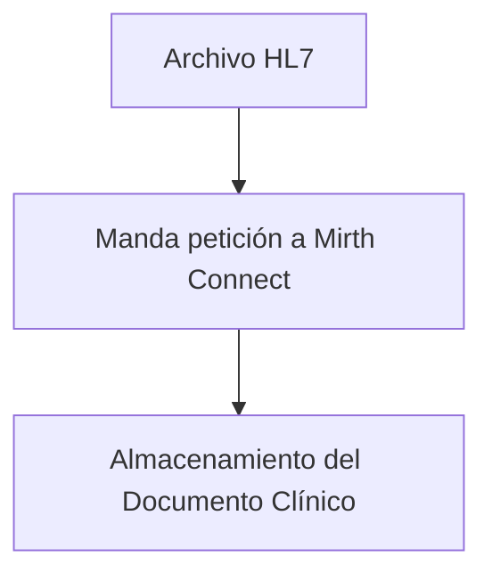

# Guía de instalación e implementación en Ubuntu  
## Proyecto: Documentos clínicos con FHIR Composition usando HAPI FHIR + Mirth Connect + Postman

### Integrantes
- **Braikan Piña**
- **Freydér Pérez**

---

## 1. Requisitos previos
Antes de iniciar, asegúrate de tener en **Ubuntu**:

- **Docker Engine y Docker Compose**  
  👉 Instalar Docker en Ubuntu:  
  ```bash
  sudo apt-get update
  sudo apt-get install -y ca-certificates curl gnupg lsb-release
  sudo mkdir -m 0755 -p /etc/apt/keyrings
  curl -fsSL https://download.docker.com/linux/ubuntu/gpg | sudo gpg --dearmor -o /etc/apt/keyrings/docker.gpg
  echo     "deb [arch=$(dpkg --print-architecture) signed-by=/etc/apt/keyrings/docker.gpg] https://download.docker.com/linux/ubuntu     $(lsb_release -cs) stable" | sudo tee /etc/apt/sources.list.d/docker.list > /dev/null
  sudo apt-get update
  sudo apt-get install -y docker-ce docker-ce-cli containerd.io docker-compose-plugin
  ```

- **Postman** para realizar pruebas con el servidor FHIR  
  👉 [Descargar Postman](https://www.postman.com/downloads/)  

- **Git** (opcional, para clonar configuraciones).  
- Conexión estable a Internet.  

---

## 2. Instalación y despliegue de contenedores

### 2.1. Descargar y ejecutar la imagen de HAPI FHIR
El servidor HAPI FHIR es necesario para almacenar y consultar recursos FHIR.

```bash
sudo docker run -d   --name hapi-fhir   -p 8081:8080   hapiproject/hapi:latest
```

- `--name hapi-fhir`: nombre del contenedor  
- `-p 8081:8080`: expone el puerto 8080 del contenedor al 8081 local  

📍 Acceso al servidor:  
[http://localhost:8081/fhir](http://localhost:8081/fhir)

---

### 2.2. Descargar y ejecutar la imagen de Mirth Connect
Mirth Connect se usará como **motor de integración HL7 → FHIR**.

```bash
sudo docker run -d   --name myconnect   -p 8443:8443   nextgenhealthcare/connect
```

- `--name myconnect`: nombre del contenedor  
- `-p 8443:8443`: expone el puerto seguro de Mirth Connect  

📍 Acceso al panel de Mirth Connect:  
[https://localhost:8443](https://localhost:8443)  

Usuario/contraseña por defecto:  
- user: `admin`  
- pass: `admin`  

---

### 2.3. Verificar que los contenedores estén activos
Ejecutar:

```bash
sudo docker ps -a
```

Ejemplo de salida:

```
CONTAINER ID   IMAGE                                 COMMAND                  CREATED       STATUS        PORTS
6c2cb26e8733   hapiproject/hapi:latest               "java --class-path /…"   4 days ago    Up 2 days     0.0.0.0:8081->8080/tcp   hapi-fhir
ca135958b4fd   nextgenhealthcare/connect             "/entrypoint.sh ./mc…"   4 days ago    Up 2 days     0.0.0.0:8443->8443/tcp   myconnect
```

---

## 3. Configuración de Mirth Connect

1. Iniciar sesión en el panel de administración.  
2. Crear un **nuevo canal** de integración.  
3. Configurar como **fuente (Source)** un conector **HL7 Listener**.  
4. Configurar como **destino (Destination)** un conector **HTTP Sender**, apuntando al servidor HAPI FHIR:  

   ```
   http://hapi-fhir:8080/fhir/Bundle
   ```

   *(Si pruebas desde Postman o navegador local, usa `http://localhost:8081/fhir/Bundle`)*

5. Guardar y desplegar el canal.  

---

## 4. Ejemplo de transformación HL7 a FHIR en Mirth Connect (JavaScript Transformer)

```javascript
/**
 * Este código se ejecuta en un transformador de JavaScript en Mirth Connect.
 * 1. Lee un mensaje HL7 v2.x entrante.
 * 2. Extrae información del paciente.
 * 3. Crea recursos FHIR (Patient, Composition) en formato JSON.
 * 4. Ensambla estos recursos en un Bundle FHIR de tipo "document".
 * 5. Coloca el Bundle en el channelMap para el conector de destino.
 */
try {
    var patientId = 'urn:uuid:' + java.util.UUID.randomUUID();
    var patient = {
      "resourceType": "Patient",
      "id": patientId.split(':')[2],
      "name": [{
        "use": "official",
        "family": msg['PID']['PID.5']['PID.5.1'].toString(),
        "given": [msg['PID']['PID.5']['PID.5.2'].toString()]
      }],
      "gender": msg['PID']['PID.8']['PID.8.1'].toString().toLowerCase() === 'm' ? 'male' : 'female'
    };
    var composition = {
      "resourceType": "Composition",
      "status": "final",
      "type": {
        "coding": [{
          "system": "http://loinc.org",
          "code": "34133-9",
          "display": "Summarization of episode note"
        }]
      },
      "subject": {
        "reference": patientId
      },
      "date": new Date().toISOString(),
      "author": [{
          "display": "Sistema de Integración Mirth Connect"
      }],
      "title": "Documento de Resumen Clínico",
      "section": [{
        "title": "Observaciones Clínicas",
        "text": {
            "status": "generated",
            "div": "<div xmlns=\"http://www.w3.org/1999/xhtml\"><p>Este es un resumen de prueba generado a partir de un mensaje HL7.</p></div>"
        }
      }]
    };
    var bundle = {
      "resourceType": "Bundle",
      "type": "document",
      "timestamp": new Date().toISOString(),
      "entry": []
    };
    bundle.entry.push({
      "fullUrl": 'urn:uuid:' + java.util.UUID.randomUUID(),
      "resource": composition
    });
    bundle.entry.push({
      "fullUrl": patientId,
      "resource": patient
    });
    var fhirPayload = JSON.stringify(bundle, null, 2);
    channelMap.put('fhirBundle', fhirPayload);
    return true;
} catch (e) {
    logger.error("Ocurrió un error al transformar HL7 a FHIR Composition: " + e);
    return false;
}
```

---

## 5. Ejemplo de Bundle FHIR tipo Document

```json
{
  "resourceType": "Bundle",
  "type": "document",
  "entry": [
    {
      "fullUrl": "urn:uuid:composition-1",
      "resource": {
        "resourceType": "Composition",
        "status": "final",
        "type": {
          "coding": [
            {
              "system": "http://loinc.org",
              "code": "18842-5",
              "display": "Discharge summary"
            }
          ]
        },
        "subject": {
          "reference": "urn:uuid:patient-1"
        },
        "date": "2025-09-15T12:00:00Z",
        "title": "Resumen de egreso",
        "section": [
          {
            "title": "Diagnóstico",
            "text": {
              "status": "generated",
              "div": "<div>Paciente con diagnóstico de hipertensión arterial</div>"
            }
          },
          {
            "title": "Tratamiento",
            "text": {
              "status": "generated",
              "div": "<div>Tratamiento con enalapril 10mg diarios</div>"
            }
          }
        ]
      }
    },
    {
      "fullUrl": "urn:uuid:patient-1",
      "resource": {
        "resourceType": "Patient",
        "id": "patient-1",
        "name": [
          {
            "use": "official",
            "family": "García",
            "given": ["Juan"]
          }
        ],
        "gender": "male",
        "birthDate": "1980-01-01"
      }
    }
  ]
}
```

---

## 6. Envío del Bundle a HAPI FHIR con Postman

### Configuración:
- **Método:** `POST`  
- **URL:**  
  ```
  http://localhost:8081/fhir/Bundle
  ```
- **Headers:**  
  ```
  Content-Type: application/fhir+json
  ```
- **Body:**  
  Pegar el `Bundle` en formato **raw JSON**.

📍 Si la carga es exitosa, HAPI FHIR devolverá un `200 OK` con la información del recurso creado.

---

## 7. Diagrama de Flujo del Proceso



---

## 8. Conclusiones
- Se levantaron **contenedores Docker en Ubuntu** para HAPI FHIR y Mirth Connect.  
- Se configuró un canal de integración en Mirth Connect para transformar mensajes HL7 en recursos FHIR.  
- Se construyó un recurso `Composition` y se empaquetó en un **Bundle tipo document**.  
- Se probó el envío del documento clínico al servidor HAPI FHIR usando **Postman**.  

Este flujo demuestra la integración entre **HL7 v2**, **FHIR**, **Mirth Connect**, **Docker en Ubuntu** y **HAPI FHIR** en la gestión de documentos clínicos.  

---
